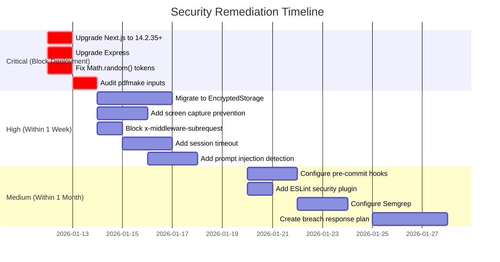

# LumiMD Security Audit Report

**Generated:** January 12, 2026  
**Audited Against:** [SECURITY_AUDIT.md](file:///Users/tylermcanally/LumiMD/Codebase/docs/SECURITY_AUDIT.md)

---

## Executive Summary

This report cross-references the LumiMD codebase against the security audit document. The codebase demonstrates **strong API security practices** but has **critical dependency vulnerabilities** and **mobile security gaps** that require attention.

| Severity | Issues Found | Immediate Action Required |
|----------|-------------|--------------------------|
| 🔴 Critical | 4 | Yes - block deployment |
| 🟠 High | 6 | Yes - within 1 week |
| 🟡 Medium | 5 | Within 1 month |
| 🟢 Good Practices | 12 | Already implemented |

---

## 🔴 Critical Findings (Fix Before Deployment)

### 1. Next.js Vulnerabilities (CVE-2024-34351, CVE-2025-29927)

**Status:** ❌ VULNERABLE  
**Current Version:** 14.1.0  
**Required Version:** 14.2.35+

```
npm audit output (web-portal):
- GHSA-mwv6-3258-q52c: DoS via Server Components (CVSS 7.5)
- GHSA-5j59-xgg2-r9c4: Incomplete fix follow-up (CVSS 7.5)
```

**Location:** [web-portal/package.json](file:///Users/tylermcanally/LumiMD/Codebase/web-portal/package.json#L32)

**Action Required:**
```bash
cd web-portal && npm install next@14.2.35
```

---

### 2. Express/qs DoS Vulnerability

**Status:** ❌ VULNERABLE  
**Current Version:** express@4.18.2  
**CVE:** GHSA-6rw7-vpxm-498p (CVSS 7.5)

```
npm audit output (functions):
- qs arrayLimit bypass allows DoS via memory exhaustion
```

**Location:** [functions/package.json](file:///Users/tylermcanally/LumiMD/Codebase/functions/package.json#L27)

**Action Required:**
```bash
cd functions && npm update express
```

---

### 3. Insufficient Randomness for Security Tokens (CWE-330)

**Status:** ❌ INSECURE  
**Audit Document Reference:** "AI often suggests Math.random() for security-critical operations"

**Locations using `Math.random()` for security:**

| File | Line | Usage |
|------|------|-------|
| [send-verification-email/route.ts](file:///Users/tylermcanally/LumiMD/Codebase/web-portal/app/api/send-verification-email/route.ts#L92) | 92 | Email verification token |
| [send-verification-email-simple/route.ts](file:///Users/tylermcanally/LumiMD/Codebase/web-portal/app/api/send-verification-email-simple/route.ts#L42) | 42 | Email verification token |
| [lumibotAnalyzer.ts](file:///Users/tylermcanally/LumiMD/Codebase/functions/src/services/lumibotAnalyzer.ts#L36) | 36 | Sequence ID (non-critical) |
| [users.ts](file:///Users/tylermcanally/LumiMD/Codebase/functions/src/routes/users.ts#L554) | 554 | Condition group ID (non-critical) |

**Fix Required:** Replace `Math.random()` with cryptographically secure random:
```typescript
// Node.js
import { randomBytes } from 'crypto';
const verificationToken = randomBytes(32).toString('hex');

// or use uuid
import { v4 as uuidv4 } from 'uuid';
const token = uuidv4();
```

---

### 4. pdfmake RCE Vulnerabilities (CVE-2024-25180, CVE-2022-46161)

**Status:** ⚠️ NEEDS INVESTIGATION  
**Current Version:** 0.2.20  
**CVSS Score:** 9.8 (CRITICAL)

**Location:** [functions/package.json](file:///Users/tylermcanally/LumiMD/Codebase/functions/package.json#L33)

**Usage Found:**
- [pdfGenerator.ts](file:///Users/tylermcanally/LumiMD/Codebase/functions/src/services/pdfGenerator.ts) - Provider health reports
- [caregiverEmailService.ts](file:///Users/tylermcanally/LumiMD/Codebase/functions/src/services/caregiverEmailService.ts) - Email attachments

**Assessment:** PDF inputs are generated from **sanitized Firestore data**, not raw user input. Risk is **mitigated but not eliminated**.

**Action Required:**
1. Upgrade to latest pdfmake
2. Audit all data flowing into PDF generation

---

## 🟠 High Severity Findings (Fix Within 1 Week)

### 5. AsyncStorage Unencrypted (Mobile Data at Rest)

**Status:** ❌ NOT ENCRYPTED  
**Audit Document Reference:** "AsyncStorage stores data unencrypted in plaintext"

**Locations using AsyncStorage:**

| File | Usage | Sensitivity |
|------|-------|-------------|
| [index.tsx](file:///Users/tylermcanally/LumiMD/Codebase/mobile/app/index.tsx#L102-L133) | Visit ID storage | Medium |
| [settings.tsx](file:///Users/tylermcanally/LumiMD/Codebase/mobile/app/settings.tsx#L42-L95) | Push token storage | High |
| [WebPortalBanner.tsx](file:///Users/tylermcanally/LumiMD/Codebase/mobile/components/WebPortalBanner.tsx#L15-L27) | UI preference | Low |

**Not Found:** ❌ `EncryptedStorage` or `Keychain` usage

**Recommendation:** Migrate sensitive storage to `react-native-encrypted-storage`

---

### 6. No Screen Capture Prevention

**Status:** ❌ NOT IMPLEMENTED  
**Audit Document Reference:** "Add screen capture prevention (FLAG_SECURE, secureContentView)"

**Search Results:** No `FLAG_SECURE` or `secureContent` found in mobile codebase.

**Action Required:** Implement screen capture prevention for health data screens

---

### 7. Missing x-middleware-subrequest Header Block

**Status:** ❌ NOT BLOCKED  
**Audit Document Reference:** "Block x-middleware-subrequest header at WAF/load balancer level"  
**CVE:** CVE-2025-29927 (Middleware Authorization Bypass)

**Search Results:** No blocking of this header found. This is a Next.js specific bypass attack.

**Action Required:** Add header blocking at Vercel/Firebase level or in middleware:
```typescript
// middleware.ts
if (request.headers.get('x-middleware-subrequest')) {
  return new Response('Forbidden', { status: 403 });
}
```

---

### 8. No Session Timeout Implemented

**Status:** ⚠️ NOT FOUND  
**Audit Document Reference:** "Implement automatic session timeout (recommended: 15-30 minutes)"

**Search Results:** No `sessionTimeout` or `tokenExpiry` configuration found.

**Assessment:** Firebase Auth tokens have 1-hour default expiry, but no explicit inactivity timeout exists.

---

### 9. Universal Links Partially Configured

**Status:** ⚠️ PARTIAL  
**Current:** Custom scheme `lumimd://` defined + Universal Links configured

**Found in [app.json](file:///Users/tylermcanally/LumiMD/Codebase/mobile/app.json#L19-L21):**
```json
"associatedDomains": ["applinks:lumimd.app"]
```

**Good:** Universal Links are configured for iOS (more secure than custom schemes).

**Not Found:** Android App Links configuration in `android/intentFilters`.

---

### 10. No Prompt Injection Detection

**Status:** ❌ NOT IMPLEMENTED  
**Audit Document Reference:** "Implement prompt injection detection layer"

**OpenAI usage found in 10+ files** using `role: 'system'` prompts but no input validation for injection patterns like:
- `ignore previous instructions`
- `system: override`
- Delimiter escapes

**Action Required:** Add input sanitization layer before OpenAI calls.

---

## 🟡 Medium Severity Findings (Fix Within 1 Month)

### 11. Zod Version Outdated (web-portal)

**Status:** ⚠️ GOOD (functions), ❌ OUTDATED (web-portal)  
**Current:** functions has 3.22.4 ✅, web-portal has 4.1.13 (check CVE applicability)

**Note:** Zod 4.x is a major version change; verify CVE-2023-4316 (ReDoS in email validation) is patched.

---

### 12. No Pre-commit Secret Detection Hooks

**Status:** ❌ NOT CONFIGURED  
**Audit Document Reference:** "Configure GitGuardian or Gitleaks pre-commit hook"

**Files Found:**
- No `.pre-commit-config.yaml`
- No `gitleaks.toml`

**Good News:** `.env` files are properly gitignored and not in git history for actual secrets.

---

### 13. No ESLint Security Plugin

**Status:** ❌ NOT CONFIGURED  
**Audit Document Reference:** "ESLint with eslint-plugin-security"

**Action Required:**
```bash
npm install eslint-plugin-security
```

---

### 14. No Semgrep Configuration

**Status:** ❌ NOT CONFIGURED  
**Audit Document Reference:** "Configure Semgrep with React/TypeScript rules"

No `.semgrep.yml` found.

---

### 15. FTC HBNR Breach Response Plan

**Status:** ❌ NOT DOCUMENTED

**Audit Document Reference:** LumiMD falls under FTC Health Breach Notification Rule requiring:
- Breach notification templates
- 60-day notification timeline
- User contact preferences

**Action Required:** Create incident response plan documentation.

---

## 🟢 Well-Implemented Security (Already Good!)

| Area | Status | Evidence |
|------|--------|----------|
| **Firebase Security Rules** | ✅ Excellent | Proper `isOwner()` checks on all collections, no `allow: true` patterns |
| **Storage Rules** | ✅ Secure | Owner + viewer permission checks with accepted share status |
| **Helmet.js Security Headers** | ✅ Configured | CSP, HSTS, frameguard, noSniff all configured in [index.ts](file:///Users/tylermcanally/LumiMD/Codebase/functions/src/index.ts#L112-L145) |
| **Rate Limiting** | ✅ Comprehensive | 4 different rate limiters: API, strict, auth, share |
| **CORS Whitelist** | ✅ Proper | Explicit origin allowlist, no `*` wildcard |
| **Token Revocation Check** | ✅ HIPAA Compliant | `verifyIdToken(token, true)` with checkRevoked=true |
| **Error Sanitization** | ✅ Production Safe | Stack traces hidden in production |
| **XSS Prevention** | ✅ No `dangerouslySetInnerHTML` | No usage found in codebase |
| **No eval()** | ✅ Clean | No unsafe code execution patterns |
| **Third-party Analytics** | ✅ Clean | No Google Analytics, Mixpanel, etc. found sharing health data |
| **HTTPS Enforcement** | ✅ Configured | `requireHttps` middleware applied |
| **Input Validation** | ✅ Zod Schemas | API routes use Zod for validation |

---

## Priority Remediation Order



---

## Summary

**Overall Security Posture:** 🟡 **Moderate Risk**

The LumiMD codebase has **excellent API-level security** (Firebase rules, CORS, rate limiting, helmet) but needs immediate attention on:

1. **Dependency updates** (Next.js, Express)
2. **Cryptographic randomness** for verification tokens
3. **Mobile data encryption** at rest

No evidence of secrets in git history or third-party health data sharing was found, which is positive for FTC HBNR compliance.
